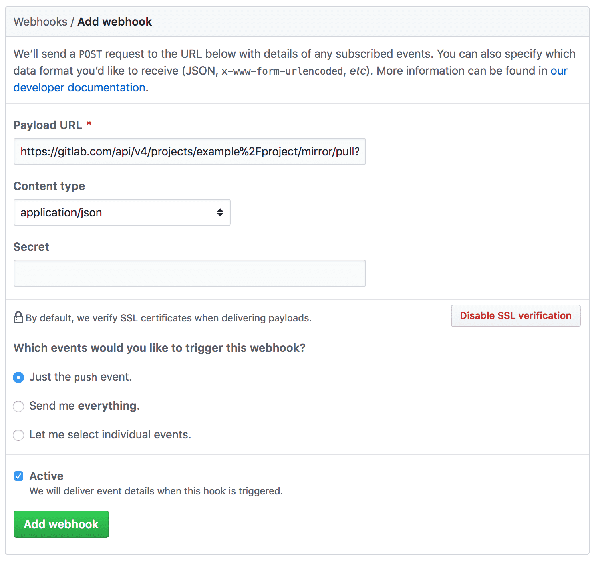

# Using GitLab CI/CD with a GitHub repository **[PREMIUM]**

GitLab CI/CD can be used with **GitHub.com** and **GitHub Enterprise** by
creating a [CI/CD project](index.md) to connect your GitHub repository to
GitLab.

<i class="fa fa-youtube-play youtube" aria-hidden="true"></i>
Watch a video on [Using GitLab CI/CD pipelines with GitHub repositories](https://www.youtube.com/watch?v=qgl3F2j-1cI).

## Connect with GitHub integration

If the [GitHub integration](../../integration/github.md) has been enabled by your GitLab
administrator:

1. In GitLab create a **CI/CD for external repo** project and select
   **GitHub**.

    

1. Once authenticated, you will be redirected to a list of your repositories to
   connect. Click **Connect** to select the repository.

    

1. In GitHub, add a `.gitlab-ci.yml` to [configure GitLab CI/CD](../quick_start/README.md).

GitLab will:

1. Import the project.
1. Enable [Pull Mirroring](../../workflow/repository_mirroring.md#pulling-from-a-remote-repository-starter).
1. Enable [GitHub project integration](../../user/project/integrations/github.md).
1. Create a web hook on GitHub to notify GitLab of new commits.

CAUTION: **Caution:**
Due to a 10-token limitation on the [GitHub OAuth Implementation](https://developer.github.com/apps/building-oauth-apps/authorizing-oauth-apps/#creating-multiple-tokens-for-oauth-apps),
if you import more than 10 times, your oldest imported project's token will be
revoked. See issue [#9147](https://gitlab.com/gitlab-org/gitlab-ee/issues/9147)
for more information.

## Connect with Personal Access Token

NOTE: **Note:**
Personal access tokens can only be used to connect GitHub.com
repositories to GitLab.

If you are not using the [GitHub integration](../../integration/github.md), you can
still perform a one-off authorization with GitHub to grant GitLab access your
repositories:

1. Open <https://github.com/settings/tokens/new> to create a **Personal Access
   Token**. This token with be used to access your repository and push commit
   statuses to GitHub.

    The `repo` and `admin:repo_hook` should be enable to allow GitLab access to
    your project, update commit statuses, and create a web hook to notify
    GitLab of new commits.

1. In GitLab create a **CI/CD for external repo** project and select
   **GitHub**.

    

1. Paste the token into the **Personal access token** field and click **List
   Repositories**. Click **Connect** to select the repository.

1. In GitHub, add a `.gitlab-ci.yml` to [configure GitLab CI/CD](../quick_start/README.md).

GitLab will import the project, enable [Pull Mirroring](../../workflow/repository_mirroring.md#pulling-from-a-remote-repository-starter), enable
[GitHub project integration](../../user/project/integrations/github.md), and create a web hook
on GitHub to notify GitLab of new commits.

## Connect manually

NOTE: **Note:**
To use **GitHub Enterprise** with **GitLab.com** use this method.

If the [GitHub integration](../../integration/github.md) is not enabled, or is enabled
for a different GitHub instance, you GitLab CI/CD can be manually enabled for
your repository:

1. In GitHub open <https://github.com/settings/tokens/new> create a **Personal
   Access Token.** GitLab will use this token to access your repository and
   push commit statuses.

    Enter a **Token description** and update the scope to allow:

    `repo` so that GitLab can access your project and update commit statuses

1. In GitLab create a **CI/CD project** using the Git URL option and the HTTPS
   URL for your GitHub repository. If your project is private, use the personal
   access token you just created for authentication.

    GitLab will automatically configure polling-based pull mirroring.

1. Still in GitLab, enable the [GitHub project integration](../../user/project/integrations/github.md)
   from **Settings > Integrations.**

    Check the **Active** checkbox to enable the integration, paste your
    personal access token and HTTPS repository URL into the form, and **Save.**

1. Still in GitLab create a **Personal Access Token** with `API` scope to
   authenticate the GitHub web hook notifying GitLab of new commits.

1. In GitHub from **Settings > Webhooks** create a web hook to notify GitLab of
   new commits.

    The web hook URL should be set to the GitLab API to
    [trigger pull mirroring](https://docs.gitlab.com/ee/api/projects.html#start-the-pull-mirroring-process-for-a-project-starter),
    using the GitLab personal access token we just created.

    ```
    https://gitlab.com/api/v4/projects/<NAMESPACE>%2F<PROJECT>/mirror/pull?private_token=<PERSONAL_ACCESS_TOKEN>
    ```

    

1. In GitHub add a `.gitlab-ci.yml` to configure GitLab CI/CD.

<!-- ## Troubleshooting

Include any troubleshooting steps that you can foresee. If you know beforehand what issues
one might have when setting this up, or when something is changed, or on upgrading, it's
important to describe those, too. Think of things that may go wrong and include them here.
This is important to minimize requests for support, and to avoid doc comments with
questions that you know someone might ask.

Each scenario can be a third-level heading, e.g. `### Getting error message X`.
If you have none to add when creating a doc, leave this section in place
but commented out to help encourage others to add to it in the future. -->
