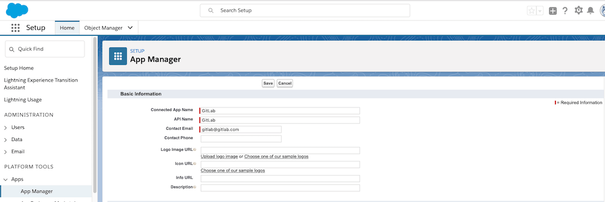

# SalesForce OmniAuth Provider

You can integrate your GitLab instance with [SalesForce](https://www.salesforce.com/) to enable users to login to your GitLab instance with their SalesForce account.

## Create SalesForce Application

To enable SalesForce OmniAuth provider, you must use SalesForce's credentials for your GitLab instance.
To get the credentials (a pair of Client ID and Client Secret), you must register an application on SalesForces.

1.  Sign in to [SalesForce](https://www.salesforce.com/).

1.  Navigate to **Platform Tools/Apps/App Manager** and click on **New Connected App**.

1.  Fill in the application details into the following fields:
    - **Connected App Name** and **API Name**: Set to any value but consider something like `<Organization>'s GitLab`, `<Your Name>'s GitLab`, or something else that is descriptive.
    - **Description**: Description for the application.

    
1.  Select **API (Enable OAuth Settings)** and click on **Enable OAuth Settings**.
1.  Fill in the application details into the following fields:
    - **Callback URL**: The call callback URL. For example, `https://gitlab.example.com/users/auth/salesforce/callback`.
    - **Selected OAuth Scopes**: Move **Access your basic information (id, profile, email, address, phone)** and **Allow access to your unique identifier (openid)** to the right column.

    
1. Click **Save**.

1.  On your GitLab server, open the configuration file.

    For omnibus package:

    ```sh
      sudo editor /etc/gitlab/gitlab.rb
    ```

    For installations from source:

    ```sh
      cd /home/git/gitlab
      sudo -u git -H editor config/gitlab.yml
    ```

1.  See [Initial OmniAuth Configuration](omniauth.md#initial-omniauth-configuration) for initial settings.

1.  Add the provider configuration:

    For omnibus package:

    ```ruby
      gitlab_rails['omniauth_providers'] = [
        {
          "name" => "salesforce",
          "app_id" => "SALESFORCE_CLIENT_ID",
          "app_secret" => "SALESFORCE_CLIENT_SECRET"
        }
      ]
    ```

    For installation from source:

    ```
      - { name: 'salesforce',
          app_id: 'SALESFORCE_CLIENT_ID',
          app_secret: 'SALESFORCE_CLIENT_SECRET'
        }
    ```
1.  Change `SALESFORCE_CLIENT_ID` to the Consumer Key from the SalesForce connected application page.
1.  Change `SALESFORCE_CLIENT_SECRET` to the Consumer Secret from the SalesForce connected application page.
    

1.  Save the configuration file.
1.  [Reconfigure GitLab]( ../administration/restart_gitlab.md#omnibus-gitlab-reconfigure ) or [restart GitLab]( ../administration/restart_gitlab.md#installations-from-source ) for the changes to take effect if you
    installed GitLab via Omnibus or from source respectively.

On the sign in page, there should now be a SalesForce icon below the regular sign in form.
Click the icon to begin the authentication process. SalesForce will ask the user to sign in and authorize the GitLab application.
If everything goes well, the user will be returned to GitLab and will be signed in.

NOTE: **Note:**
GitLab requires the email address of each new user. Once the user is logged in using SalesForce, GitLab will redirect the user to the profile page where they will have to provide the email and verify the email.
