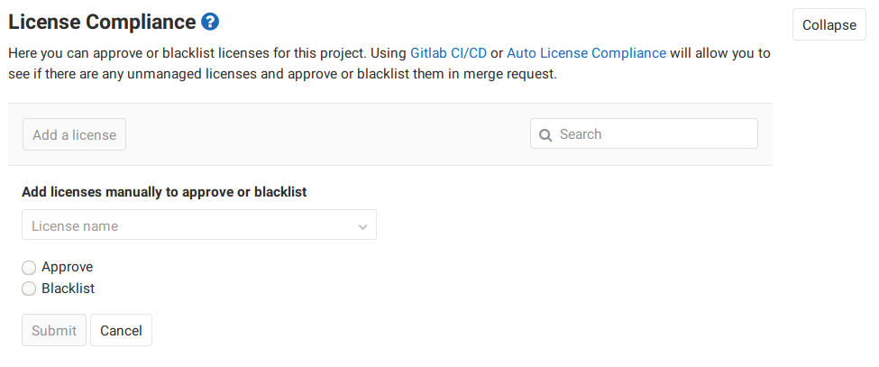
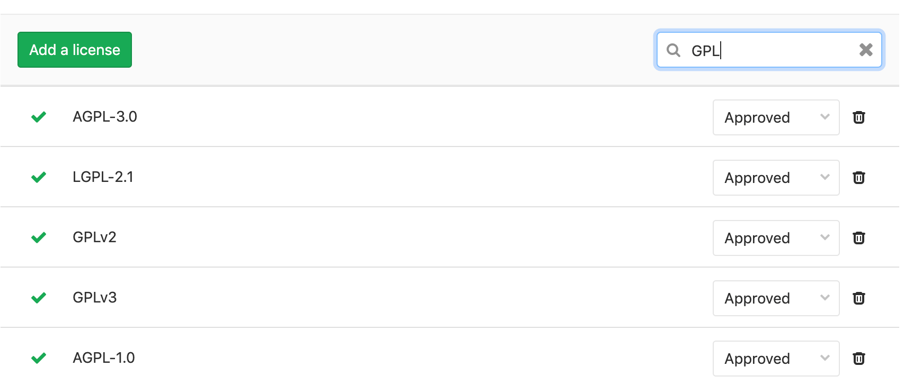
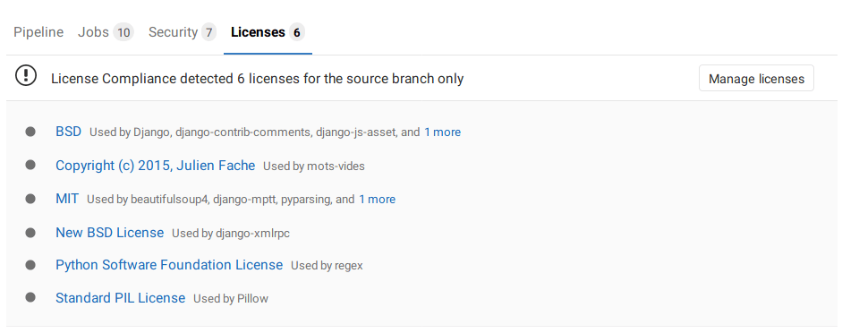

# License Compliance **(ULTIMATE)**

> [Introduced](https://gitlab.com/gitlab-org/gitlab/issues/5483) in [GitLab Ultimate](https://about.gitlab.com/pricing/) 11.0.

## Overview

If you are using [GitLab CI/CD](../../../ci/README.md), you can search your project dependencies for their licenses
using License Compliance.

You can take advantage of License Compliance by either [including the job](#configuration)
in your existing `.gitlab-ci.yml` file or by implicitly using
[Auto License Compliance](../../../topics/autodevops/index.md#auto-license-compliance-ultimate)
that is provided by [Auto DevOps](../../../topics/autodevops/index.md).

GitLab checks the License Compliance report, compares the licenses between the
source and target branches, and shows the information right on the merge request.
Blacklisted licenses will be clearly visible with an `x` red icon next to them
as well as new licenses which need a decision from you. In addition, you can
[manually approve or blacklist](#project-policies-for-license-compliance)
licenses in your project's settings.

NOTE: **Note:**
If the license compliance report doesn't have anything to compare to, no information
will be displayed in the merge request area. That is the case when you add the
`license_management` job in your `.gitlab-ci.yml` for the first time.
Consecutive merge requests will have something to compare to and the license
compliance report will be shown properly.


If you are a project or group Maintainer, you can click on a license to be given
the choice to approve it or blacklist it.


## Use cases

It helps you find what licenses your project uses in its dependencies, and decide for each of then
whether to allow it or forbid it. For example, your application is using an external (open source)
library whose license is incompatible with yours.

## Supported languages and package managers

The following languages and package managers are supported.

| Language   | Package managers                                                  | Scan Tool                                                |
|------------|-------------------------------------------------------------------|----------------------------------------------------------|
| JavaScript | [Bower](https://bower.io/), [npm](https://www.npmjs.com/), [yarn](https://yarnpkg.com/) ([experimental support](https://github.com/pivotal/LicenseFinder#experimental-project-types)) |[License Finder](https://github.com/pivotal/LicenseFinder)|
| Go         | [Godep](https://github.com/tools/godep), go get ([experimental support](https://github.com/pivotal/LicenseFinder#experimental-project-types)), gvt ([experimental support](https://github.com/pivotal/LicenseFinder#experimental-project-types)), glide ([experimental support](https://github.com/pivotal/LicenseFinder#experimental-project-types)), dep ([experimental support](https://github.com/pivotal/LicenseFinder#experimental-project-types)), trash ([experimental support](https://github.com/pivotal/LicenseFinder#experimental-project-types))  and govendor ([experimental support](https://github.com/pivotal/LicenseFinder#experimental-project-types)), [go mod](https://github.com/golang/go/wiki/Modules) ([experimental support](https://github.com/pivotal/LicenseFinder#experimental-project-types))   |[License Finder](https://github.com/pivotal/LicenseFinder)|
| Java       | [Gradle](https://gradle.org/), [Maven](https://maven.apache.org/) |[License Finder](https://github.com/pivotal/LicenseFinder)|
| .NET       | [Nuget](https://www.nuget.org/)                                   |[License Finder](https://github.com/pivotal/LicenseFinder)|
| Python     | [pip](https://pip.pypa.io/en/stable/)                             |[License Finder](https://github.com/pivotal/LicenseFinder)|
| Ruby       | [gem](https://rubygems.org/)                                      |[License Finder](https://github.com/pivotal/LicenseFinder)|
| Erlang     | [rebar](https://www.rebar3.org/) ([experimental support](https://github.com/pivotal/LicenseFinder#experimental-project-types))|[License Finder](https://github.com/pivotal/LicenseFinder)|
| Objective-C, Swift | [Carthage](https://github.com/Carthage/Carthage) , [CocoaPods v0.39 and below](https://cocoapods.org/) ([experimental support](https://github.com/pivotal/LicenseFinder#experimental-project-types))  |[License Finder](https://github.com/pivotal/LicenseFinder)|
| Elixir     | [mix](https://elixir-lang.org/getting-started/mix-otp/introduction-to-mix.html) ([experimental support](https://github.com/pivotal/LicenseFinder#experimental-project-types)) |[License Finder](https://github.com/pivotal/LicenseFinder)|
| C++/C      | [conan](https://conan.io/) ([experimental support](https://github.com/pivotal/LicenseFinder#experimental-project-types))|[License Finder](https://github.com/pivotal/LicenseFinder)|
| Scala      | [sbt](https://www.scala-sbt.org/) ([experimental support](https://github.com/pivotal/LicenseFinder#experimental-project-types))|[License Finder](https://github.com/pivotal/LicenseFinder)|
| Rust       | [cargo](https://crates.io/) ([experimental support](https://github.com/pivotal/LicenseFinder#experimental-project-types))|[License Finder](https://github.com/pivotal/LicenseFinder)|
| PHP        | [composer](https://getcomposer.org/) ([experimental support](https://github.com/pivotal/LicenseFinder#experimental-project-types))|[License Finder](https://github.com/pivotal/LicenseFinder)|

## Requirements

To run a License Compliance scanning job, you need GitLab Runner with the
[`docker` executor](https://docs.gitlab.com/runner/executors/docker.html).

## Configuration

For GitLab 11.9 and later, to enable License Compliance, you must
[include](../../../ci/yaml/README.md#includetemplate) the
[`License-Management.gitlab-ci.yml` template](https://gitlab.com/gitlab-org/gitlab/blob/master/lib/gitlab/ci/templates/Security/License-Management.gitlab-ci.yml)
that's provided as a part of your GitLab installation.
For GitLab versions earlier than 11.9, you can copy and use the job as defined
that template.

Add the following to your `.gitlab-ci.yml` file:

```yaml
include:
  template: License-Management.gitlab-ci.yml
```

The included template will create a `license_management` job in your CI/CD pipeline
and scan your dependencies to find their licenses.

The results will be saved as a
[License Compliance report artifact](../../../ci/yaml/README.md#artifactsreportslicense_management-ultimate)
that you can later download and analyze. Due to implementation limitations, we
always take the latest License Compliance artifact available. Behind the scenes, the
[GitLab License Compliance Docker image](https://gitlab.com/gitlab-org/security-products/license-management)
is used to detect the languages/frameworks and in turn analyzes the licenses.

The License Compliance settings can be changed through environment variables by using the
[`variables`](../../../ci/yaml/README.md#variables) parameter in `.gitlab-ci.yml`. These variables are documented in the [License Compliance documentation](https://gitlab.com/gitlab-org/security-products/license-management#settings).

### Installing custom dependencies

> Introduced in [GitLab Ultimate](https://about.gitlab.com/pricing/) 11.4.

The `license_management` image already embeds many auto-detection scripts, languages,
and packages. Nevertheless, it's almost impossible to cover all cases for all projects.
That's why sometimes it's necessary to install extra packages, or to have extra steps
in the project automated setup, like the download and installation of a certificate.
For that, a `LICENSE_MANAGEMENT_SETUP_CMD` environment variable can be passed to the container,
with the required commands to run before the license detection.

If present, this variable will override the setup step necessary to install all the packages
of your application (e.g.: for a project with a `Gemfile`, the setup step could be
`bundle install`).

For example:

```yaml
include:
  template: License-Management.gitlab-ci.yml

variables:
  LICENSE_MANAGEMENT_SETUP_CMD: sh my-custom-install-script.sh
```

In this example, `my-custom-install-script.sh` is a shell script at the root
directory of your project.

### Overriding the template

If you want to override the job definition (for example, change properties like
`variables` or `dependencies`), you need to declare a `license_management` job
after the template inclusion and specify any additional keys under it. For example:

```yaml
include:
  template: License-Management.gitlab-ci.yml

license_management:
  variables:
    CI_DEBUG_TRACE: "true"
```

### Configuring Maven projects

The License Compliance tool provides a `MAVEN_CLI_OPTS` environment variable which can hold
the command line arguments to pass to the `mvn install` command which is executed under the hood.
Feel free to use it for the customization of Maven execution. For example:

```yaml
include:
  template: License-Management.gitlab-ci.yml

license_management:
  variables:
    MAVEN_CLI_OPTS: --debug
```

`mvn install` runs through all of the [build life cycle](http://maven.apache.org/guides/introduction/introduction-to-the-lifecycle.html)
stages prior to `install`, including `test`. Running unit tests is not directly
necessary for the license scanning purposes and consumes time, so it's skipped
by having the default value of `MAVEN_CLI_OPTS` as `-DskipTests`. If you want
to supply custom `MAVEN_CLI_OPTS` and skip tests at the same time, don't forget
to explicitly add `-DskipTests` to your options.
If you still need to run tests during `mvn install`, add `-DskipTests=false` to
`MAVEN_CLI_OPTS`.

### Selecting the version of Python

> - [Introduced](https://gitlab.com/gitlab-org/security-products/license-management/merge_requests/36) in [GitLab Ultimate](https://about.gitlab.com/pricing/) 12.0.
> - In GitLab 12.2, Python 3.5 became the default.

License Compliance uses Python 3.5 and pip 19.1 by default.
If your project requires Python 2, you can switch to Python 2.7 and pip 10.0
by setting the `LM_PYTHON_VERSION` environment variable to `2`.

```yaml
include:
  template: License-Management.gitlab-ci.yml

license_management:
  variables:
    LM_PYTHON_VERSION: 2
```

## Project policies for License Compliance

> [Introduced](https://gitlab.com/gitlab-org/gitlab/issues/5940) in [GitLab Ultimate](https://about.gitlab.com/pricing/) 11.4.

From the project's settings:

- The list of licenses and their status can be managed.
- Licenses can be manually approved or blacklisted.

To approve or blacklist a license:

1. Either use the **Manage licenses** button in the merge request widget, or
   navigate to the project's **Settings > CI/CD** and expand the
   **License Compliance** section.
1. Click the **Add a license** button.

   

1. In the **License name** dropdown, either:
   - Select one of the available licenses. You can search for licenses in the field
     at the top of the list.
   - Enter arbitrary text in the field at the top of the list. This will cause the text to be
     added as a license name to the list.
1. Select the **Approve** or **Blacklist** radio button to approve or blacklist respectively
   the selected license.

To modify an existing license:

1. In the **License Compliance** list, click the **Approved/Declined** dropdown to change it to the desired status.

   

Searching for Licenses:

1. Use the **Search** box to search for a specific license.

   

## License Compliance report under pipelines

> [Introduced](https://gitlab.com/gitlab-org/gitlab/issues/5491) in [GitLab Ultimate](https://about.gitlab.com/pricing/) 11.2.

From your project's left sidebar, navigate to **CI/CD > Pipelines** and click on the
pipeline ID that has a `license_management` job to see the Licenses tab with the listed
licenses (if any).



<!-- ## Troubleshooting

Include any troubleshooting steps that you can foresee. If you know beforehand what issues
one might have when setting this up, or when something is changed, or on upgrading, it's
important to describe those, too. Think of things that may go wrong and include them here.
This is important to minimize requests for support, and to avoid doc comments with
questions that you know someone might ask.

Each scenario can be a third-level heading, e.g. `### Getting error message X`.
If you have none to add when creating a doc, leave this section in place
but commented out to help encourage others to add to it in the future. -->
