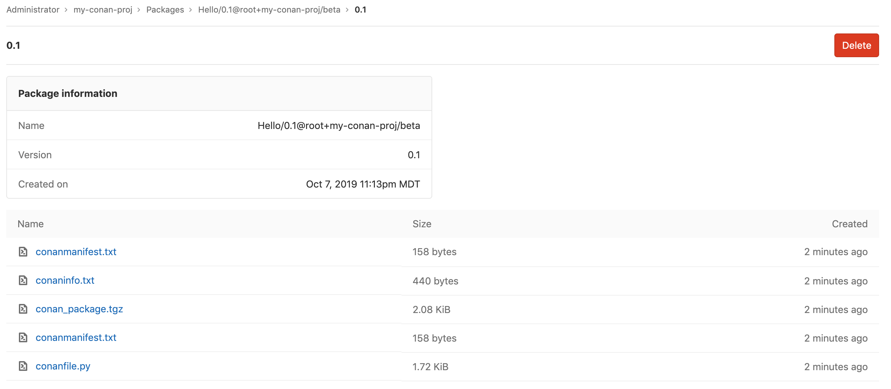

# GitLab Conan Repository **(PREMIUM)**

> [Introduced](https://gitlab.com/gitlab-org/gitlab-ee/issues/8248) in [GitLab Premium](https://about.gitlab.com/pricing/) 12.6.

With the GitLab Conan Repository, every
project can have its own space to store Conan packages.



## Enabling the Conan Repository

NOTE: **Note:**
This option is available only if your GitLab administrator has
[enabled support for the Conan Repository](../../../administration/packages/index.md).**(PREMIUM ONLY)**

After the Conan Repository is enabled, it will be available for all new projects
by default. To enable it for existing projects, or if you want to disable it:

1. Navigate to your project's **Settings > General > Permissions**.
1. Find the Packages feature and enable or disable it.
1. Click on **Save changes** for the changes to take effect.

You should then be able to see the **Packages** section on the left sidebar.

Before proceeding to authenticating with the GitLab Conan Repository, you should
get familiar with the package naming convention.

## Authenticating to the GitLab Conan Repository

You will need to generate a [personal access token](../../../user/profile/personal_access_tokens.md) with the scope set to `api` for repository authentication.

Now you can run conan commands using your token.

`CONAN_LOGIN_USERNAME=<gitlab-username> CONAN_PASSWORD=<personal_access_token> conan upload Hello/0.2@user/channel --remote=gitlab`
`CONAN_LOGIN_USERNAME=<gitlab-username> CONAN_PASSWORD=<personal_access_token> conan search Hello* --all --remote=gitlab`

Alternatively, you can set the `CONAN_LOGIN_USERNAME` and `CONAN_PASSWORD` in your local conan config to be used when connecting to the `gitlab` remote. The examples here show the username and password inline.

Next, you'll need to set your Conan remote to point to the GitLab Package Registry.

## Setting the Conan remote to the GitLab Package Registry

After you authenticate to the [GitLab Conan Repository](#authenticating-to-the-gitlab-conan-repository),
you can set the Conan remote:

```sh
conan remote add gitlab https://gitlab.example.com/api/v4/packages/conan
```

Once the remote is set, you can use the remote when running Conan commands:

```sh
conan search Hello* --all --remote=gitlab
```

## Supported CLI commands

The GitLab Conan repository supports the following Conan CLI commands:

- `conan upload`: Upload your recipe and package files to the GitLab Package Registry.
- `conan install`: Install a conan package from the GitLab Package Registry, this includes using the `conan.txt` file.
- `conan search`: Search the GitLab Package Registry for public packages, and private packages you have permission to view.
- `conan info`: View the info on a given package from the GitLab Package Registry.
- `conan remove`: Delete the package from the GitLab Package Registry.

## Uploading a package

First you need to [create your Conan package locally](https://docs.conan.io/en/latest/creating_packages/getting_started.html). In order to work with the GitLab Package Registry, a specific [naming convention](#package-recipe-naming-convention) must be followed.

Ensure you have a project created on GitLab and that the personal access token you are using has the correct permissions for write access to the container registry by selecting the `api` [scope](../../../user/profile/personal_access_tokens.md#limiting-scopes-of-a-personal-access-token).

You can upload your package to the GitLab Package Registry using the `conan upload` command:

```sh
CONAN_LOGIN_USERNAME=<gitlab-username> CONAN_PASSWORD=<personal_access_token> conan upload Hello/0.1@my-group+my-project/beta --all --remote=gitlab
```

### Package recipe naming convention

Standard Conan recipe convention looks like `package_name/version@username/channel`.

**Recipe usernames must be the `+` separated project path**. The package
name may be anything, but it is preferred that the project name be used unless
it is not possible due to a naming collision. For example:

| Project                            | Package                                         | Supported |
| ---------------------------------- | ----------------------------------------------- | --------- |
| `foo/bar`                          | `my-package/1.0.0@foo+bar/stable`               | Yes       |
| `foo/bar-baz/buz`                  | `my-package/1.0.0@foo+bar-baz+buz/stable`       | Yes       |
| `gitlab-org/gitlab-ce`             | `my-package/1.0.0@gitlab-org+gitlab-ce/stable`  | Yes       |
| `gitlab-org/gitlab-ce`             | `my-package/1.0.0@foo/stable`                   | No        |

NOTE: **Note:**
A future iteration will extend support to [project and group level](https://gitlab.com/gitlab-org/gitlab/issues/11679) remotes which will allow for more flexible naming conventions.

## Installing a package

Add the conan package to the `[requires]` section of your `conan.txt` file and they will be installed when you run `conan install` within your project.

## Removing a package

There are two ways to remove a Conan package from the GitLab Package Registry.

- **Using the Conan client in the command line:**

  ```sh
  CONAN_LOGIN_USERNAME=<gitlab-username> CONAN_PASSWORD=<personal_access_token> conan remove Hello/0.2@user/channel -r gitlab
  ```

  NOTE: **Note:**
  This command will remove all recipe and binary package files from the Package Registry.

- **GitLab project interface**: in the packages view of your project page, you can delete packages by clicking the red trash icons.

## Searching the GitLab Package Registry for Conan packages

The `conan search` command can be run searching by full or partial package name, or by exact recipe.

To search using a partial name, use the wildcard symbol `*`, which should be placed at the end of your search (e.g., `my-packa*`):

```sh
CONAN_LOGIN_USERNAME=<gitlab-username> CONAN_PASSWORD=<personal_access_token> conan search Hello --all --remote=gitlab
CONAN_LOGIN_USERNAME=<gitlab-username> CONAN_PASSWORD=<personal_access_token> conan search He* --all --remote=gitlab
CONAN_LOGIN_USERNAME=<gitlab-username> CONAN_PASSWORD=<personal_access_token> conan search Hello/1.0.0@my-group+my-project/stable --all --remote=gitlab
```

The scope of your search will include all projects you have permission to access, this includes your private projects as well as all public projects.

## Fetching Conan package info from the GitLab Package Registry

The `conan info` command will return info about a given package:

```sh
CONAN_LOGIN_USERNAME=<gitlab-username> CONAN_PASSWORD=<personal_access_token> conan info Hello/1.0.0@my-group+my-project/stable -r gitlab
```
