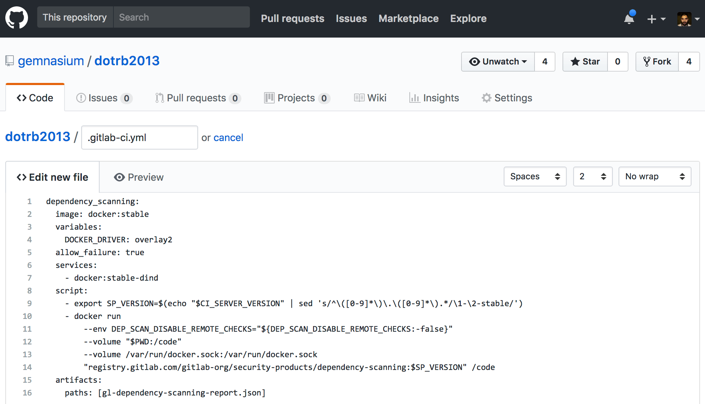
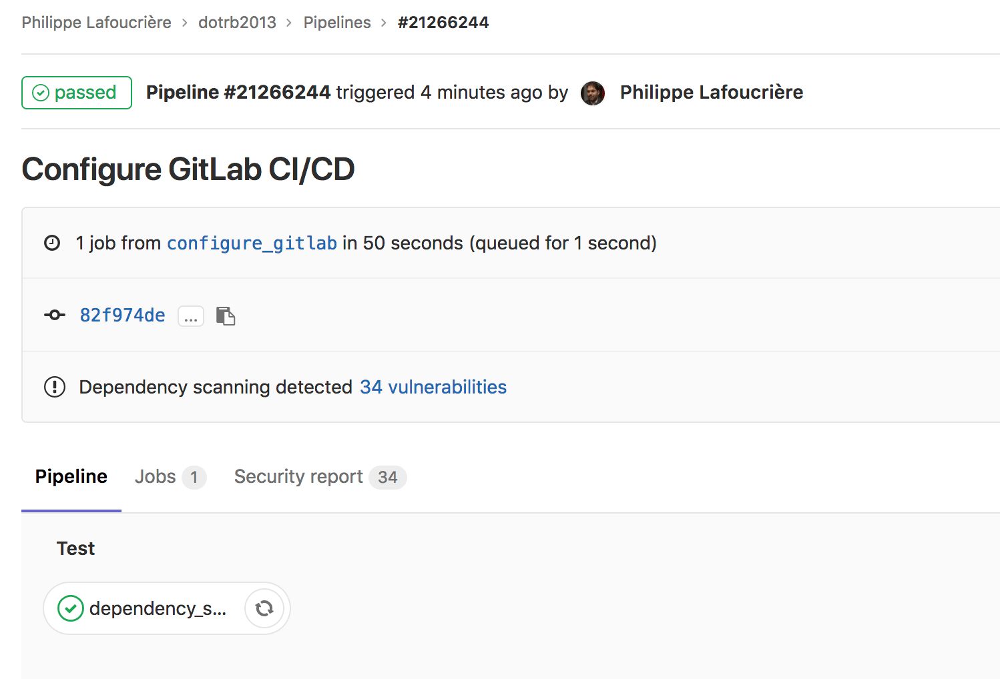

# Gemnasium **(ULTIMATE)**

This guide describes how to migrate from Gemnasium.com to your own GitLab
instance or GitLab.com.

## Why is Gemnasium.com closed?

Gemnasium has been [acquired by GitLab](https://about.gitlab.com/press/releases/2018-01-30-gemnasium-acquisition.html)
in January 2018. Since May 15, 2018, the services provided by Gemnasium are no longer available.
The team behind Gemnasium has joined GitLab as the new Security Products team
and is working on a wider range of tools than just Dependency Scanning:
[SAST](../../application_security/sast/index.md),
[DAST](../../application_security/dast/index.md),
[Container Scanning](../../application_security/container_scanning/index.md) and more.
If you want to continue monitoring your dependencies, see the
[Migrating to GitLab](#migrating-to-gitlab) section below.

## What happened to my account?

Your account has been automatically closed on May 15th, 2018. If you had a paid
subscription at that time, your card will be refunded on a pro rata temporis basis.
You may contact `gemnasium@gitlab.com` regarding your closed account.

## Will my account/data be transferred to GitLab Inc.?

All accounts and data have been deleted on May 15th, 2018. GitLab Inc.
doesn't know anything about your private data, nor your projects, and therefore
if they were vulnerable or not. GitLab Inc. takes personal information very seriously.

## What happened to my badge?

To avoid broken 404 images, all badges pointing to Gemnasium.com will be a
placeholder, inviting you to migrate to GitLab (and pointing to this page).

## Migrating to GitLab

Gemnasium has been ported and integrated directly into GitLab CI/CD.
You can still benefit from our dependency monitoring features, and it requires
some steps to migrate your projects. There is no automatic import since GitLab
doesn't know anything about any projects which existed on Gemnasium.com.
Security features are free for public (open-source) projects hosted on GitLab.com.

### If your project is hosted on GitLab (`https://gitlab.com` / self-hosted)

You're almost set! If you're already using
[Auto DevOps](../../../topics/autodevops/), you are already covered.
Otherwise, you must configure your `.gitlab-ci.yml` according to the
[dependency scanning page](../../application_security/dependency_scanning/index.md).

### If your project is hosted on GitHub (`https://github.com` / GitHub Enterprise)

Since [GitLab 10.6 comes with GitHub integration](https://about.gitlab.com/features/github/),
GitLab users can now create a CI/CD project in GitLab connected to an external
GitHub.com or GitHub Enterprise repository. This will automatically prompt
GitLab CI/CD to run whenever code is pushed to GitHub and post CI/CD results
back to both GitLab and GitHub when completed.

1. Create a new project, and select the "CI/CD for external repo" tab:

    

1. Use the "GitHub" button to connect your repositories.

    

1. Select the project(s) to be set up with GitLab CI/CD and chose "Connect".

    

    Once the configuration is done, you may click on your new
    project on GitLab.

    

    Your project is now mirrored on GitLab, where the Runners will be able to access
    your source code and run your tests.

    Optional step: If you set this up on GitLab.com, make sure the project is
    public (in the project settings) if your GitHub project is public, since
    the security feature is available only for [GitLab Ultimate](https://about.gitlab.com/pricing).

1. To set up the dependency scanning job, corresponding to what Gemnasium was
   doing, you must create a `.gitlab-ci.yml` file, or update it according to
   the [dependency scanning docs](../../application_security/dependency_scanning/index.md).
   The mirroring is pull-only by default, so you may create or update the file on
   GitHub:

    

1. Once your file has been committed, a new pipeline will be automatically
   triggered if your file is valid:

    

1. The result of the job will be visible directly from the pipeline view:

    

NOTE: **Note:**
If you don't commit very often to your project, you may want to use
[scheduled pipelines](../pipelines/schedules.md) to run the job on a regular
basis.
