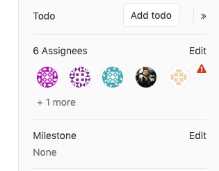
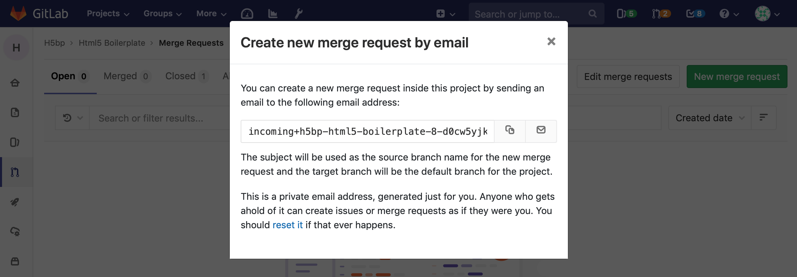

# Creating merge requests

Merge requests are the primary method of making changes to files in a GitLab project.
Changes are proposed by creating and submitting a merge request, which is then
[reviewed, and accepted (or rejected)](reviewing_and_managing_merge_requests.md),
all within GitLab.

## Creating new merge requests

You can start creating a new merge request by clicking the **New merge request** button
on the **Merge Requests** page in a project. Then you must choose the source project and
branch that contain your changes, and the target project and branch where you want to merge
the changes into. Click on **Compare branches and continue** to go to the next step
and start filling in the merge request details.

When viewing the commits on a branch other than master in **Repository > Commits**, you
can click on the **Create merge request** button, and a new merge request will be started
using the current branch as the source, and `master` in the current project as the target.

If you have recently pushed changes to GitLab, the **Create merge request** button will
also appear in the top right of the:

- **Project** page.
- **Repository > Files** page.
- **Merge Requests** page.

In this case, the merge request will use the most recent branch you pushed changes
to as the source branch, and `master` in the current project as the target.

You can also [create a new merge request directly from an issue](../repository/web_editor.md#create-a-new-branch-from-an-issue).

## Workflow for new merge requests

On the **New Merge Request** page, you can start by filling in the title and description
for the merge request. If there are are already commits on the branch, the title will
be pre-filled with the first line of the first commit message, and the description will
be pre-filled with any additional lines in the commit message. The title is the only
field that is mandatory in all cases.

From here, you can also:

- Set the merge request as a [work in progress](work_in_progress_merge_requests.md).
- Select the [assignee](#assignee), or [assignees](#multiple-assignees-starter). **(STARTER)**
- Select a [milestone](../milestones/index.md).
- Select [labels](../labels.md).
- Add any [merge request dependencies](merge_request_dependencies.md). **(PREMIUM)**
- Select [approval options](merge_request_approvals.md). **(STARTER)**
- Verify the source and target branches are correct.
- Enable the [delete source branch when merge request is accepted](#deleting-the-source-branch) option.
- Enable the [squash commits when merge request is accepted](squash_and_merge.md) option.
- If the merge request is from a fork, enable [Allow collaboration on merge requests across forks](allow_collaboration.md).

Many of these can be set when pushing changes from the command line, with
[Git push options](../push_options.md).

### Merge requests to close issues

If the merge request is being created to resolve an issue, you can add a note in the
description which will set it to [automatically close the issue](../issues/managing_issues.md#closing-issues-automatically)
when merged.

If the issue is [confidential](../issues/confidential_issues.md), you may want to
use a different workflow for [merge requests for confidential issues](../issues/confidential_issues.md#merge-requests-for-confidential-issues),
to prevent confidential information from being exposed.

## Assignee

Choose an assignee to designate someone as the person responsible for the first
[review of the merge request](reviewing_and_managing_merge_requests.md). Open the
drop down box to search for the user you wish to assign, and the merge request will be
added to their [assigned merge request list](../../search/index.md#issues-and-merge-requests).

### Multiple assignees **(STARTER)**

> [Introduced](https://gitlab.com/gitlab-org/gitlab/issues/2004) in [GitLab Starter 11.11](https://about.gitlab.com/pricing/).

Multiple people often review merge requests at the same time. GitLab allows you to
have multiple assignees for merge requests to indicate everyone that is reviewing or
accountable for it.

To assign multiple assignees to a merge request:

1. From a merge request, expand the right sidebar and locate the **Assignees** section.
1. Click on **Edit** and from the dropdown menu, select as many users as you want
   to assign the merge request to.

Similarly, assignees are removed by deselecting them from the same dropdown menu.

It's also possible to manage multiple assignees:

- When creating a merge request.
- Using [quick actions](../quick_actions.md#quick-actions-for-issues-merge-requests-and-epics).

## Deleting the source branch

When creating a merge request, select the "Delete source branch when merge
request accepted" option and the source branch will be deleted when the merge
request is merged. To make this option enabled by default for all new merge
requests, enable it in the [project's settings](../settings/index.md#merge-request-settings).

This option is also visible in an existing merge request next to the merge
request button and can be selected/deselected before merging. It's only visible
to users with [Maintainer permissions](../../permissions.md) in the source project.

If the user viewing the merge request does not have the correct permissions to
delete the source branch and the source branch is set for deletion, the merge
request widget will show the "Deletes source branch" text.

## Create new merge requests by email

_This feature needs [incoming email](../../../administration/incoming_email.md)
to be configured by a GitLab administrator to be available for CE/EE users, and
it's available on GitLab.com._

You can create a new merge request by sending an email to a user-specific email
address. The address can be obtained on the merge requests page by clicking on
a **Email a new merge request to this project** button. The subject will be
used as the source branch name for the new merge request and the target branch
will be the default branch for the project. The message body (if not empty)
will be used as the merge request description. You need
["Reply by email"](../../../administration/reply_by_email.md) enabled to use
this feature. If it's not enabled to your instance, you may ask your GitLab
administrator to do so.

This is a private email address, generated just for you. **Keep it to yourself**
as anyone who gets ahold of it can create issues or merge requests as if they were you.
You can add this address to your contact list for easy access.

_In GitLab 11.7, we updated the format of the generated email address.
However the older format is still supported, allowing existing aliases
or contacts to continue working._

### Adding patches when creating a merge request via e-mail

> [Introduced](https://gitlab.com/gitlab-org/gitlab-foss/merge_requests/22723) in GitLab 11.5.

You can add commits to the merge request being created by adding
patches as attachments to the email. All attachments with a filename
ending in `.patch` will be considered patches and they will be processed
ordered by name.

The combined size of the patches can be 2MB.

If the source branch from the subject does not exist, it will be
created from the repository's HEAD or the specified target branch to
apply the patches. The target branch can be specified using the
[`/target_branch` quick action](../quick_actions.md). If the source
branch already exists, the patches will be applied on top of it.
