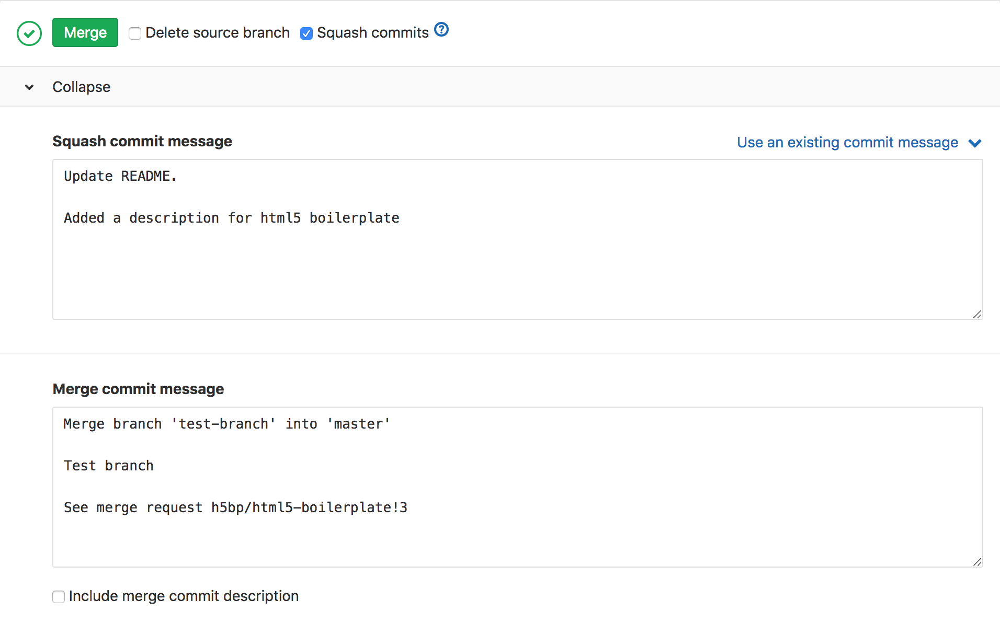

# Squash and merge

> - [Introduced](https://gitlab.com/gitlab-org/gitlab-ee/merge_requests/1024) in [GitLab Starter](https://about.gitlab.com/pricing/) 8.17.
> - [Ported](https://gitlab.com/gitlab-org/gitlab-ce/merge_requests/18956) to GitLab Core 11.0.

With squash and merge you can combine all your merge request's commits into one
and retain a clean history.

## Overview

Squashing lets you tidy up the commit history of a branch when accepting a merge
request. It applies all of the changes in the merge request as a single commit,
and then merges that commit using the merge method set for the project.

In other words, squashing a merge request turns a long list of commits:

Into a single commit on merge:

The squashed commit's commit message will be either:

- Taken from the first multi-line commit message in the merge.
- The merge request's title if no multi-line commit message is found.

It can be customized before merging a merge request.

NOTE: **Note:**
The squashed commit in this example is followed by a merge commit, as the merge method for this example repository uses a merge commit.

Squashing also works with the fast-forward merge strategy, see [squashing and fast-forward merge](#squash-and-fast-forward-merge) for more details.

## Use cases

When working on a feature branch, you sometimes want to commit your current
progress, but don't really care about the commit messages. Those 'work in
progress commits' don't necessarily contain important information and as such
you'd rather not include them in your target branch.

With squash and merge, when the merge request is ready to be merged,
all you have to do is enable squashing before you press merge to join
the commits in the merge request into a single commit.

This way, the history of your base branch remains clean with
meaningful commit messages and:

- It's simpler to [revert](revert_changes.md) if necessary.
- The merged branch will retain the full commit history.

## Enabling squash for a merge request

Anyone who can create or edit a merge request can choose for it to be squashed
on the merge request form:

This can then be overridden at the time of accepting the merge request:

## Commit metadata for squashed commits

The squashed commit has the following metadata:

- Message: the message of the squash commit, or a customized message.
- Author: the author of the merge request.
- Committer: the user who initiated the squash.

## Squash and fast-forward merge

When a project has the [fast-forward merge setting enabled](fast_forward_merge.md#enabling-fast-forward-merges), the merge
request must be able to be fast-forwarded without squashing in order to squash
it. This is because squashing is only available when accepting a merge request,
so a merge request may need to be rebased before squashing, even though
squashing can itself be considered equivalent to rebasing.

<!-- ## Troubleshooting

Include any troubleshooting steps that you can foresee. If you know beforehand what issues
one might have when setting this up, or when something is changed, or on upgrading, it's
important to describe those, too. Think of things that may go wrong and include them here.
This is important to minimize requests for support, and to avoid doc comments with
questions that you know someone might ask.

Each scenario can be a third-level heading, e.g. `### Getting error message X`.
If you have none to add when creating a doc, leave this section in place
but commented out to help encourage others to add to it in the future. -->
