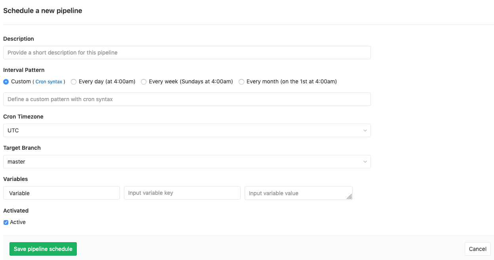

# Pipeline schedules

> **Notes**:
> - This feature was introduced in 9.1 as [Trigger Schedule][ce-10533].
> - In 9.2, the feature was [renamed to Pipeline Schedule][ce-10853].
> - Cron notation is parsed by [Fugit](https://github.com/floraison/fugit).

Pipeline schedules can be used to run a pipeline at specific intervals, for example every
month on the 22nd for a certain branch.

## Using Pipeline schedules

In order to schedule a pipeline:

1. Navigate to your project's **CI / CD ➔ Schedules** and click the
   **New Schedule** button.
1. Fill in the form
1. Hit **Save pipeline schedule** for the changes to take effect.



> **Attention:**
The pipelines won't be executed precisely, because schedules are handled by
Sidekiq, which runs according to its interval.
See [advanced admin configuration](#advanced-admin-configuration) for more
information.

In the **Schedules** index page you can see a list of the pipelines that are
scheduled to run. The next run is automatically calculated by the server GitLab
is installed on.


### Running a scheduled pipeline manually

> [Introduced][ce-15700] in GitLab 10.4.

To trigger a pipeline schedule manually, click the "Play" button:


This will schedule a background job to run the pipeline schedule. A flash
message will provide a link to the CI/CD Pipeline index page.

To help avoid abuse, users are rate limited to triggering a pipeline once per
minute.

### Making use of scheduled pipeline variables

> [Introduced][ce-12328] in GitLab 9.4.

You can pass any number of arbitrary variables and they will be available in
GitLab CI so that they can be used in your `.gitlab-ci.yml` file.


## Using only and except

To configure that a job can be executed only when the pipeline has been
scheduled (or the opposite), you can use
[only and except](../../../ci/yaml/README.md#only-and-except-simplified) configuration keywords.

```
job:on-schedule:
  only:
    - schedules
  script:
    - make world

job:
  except:
    - schedules
  script:
    - make build
```

## Taking ownership

Pipelines are executed as a user, who owns a schedule. This influences what
projects and other resources the pipeline has access to. If a user does not own
a pipeline, you can take ownership by clicking the **Take ownership** button.
The next time a pipeline is scheduled, your credentials will be used.


NOTE: **Note:**
If the owner of a pipeline schedule doesn't have the ability to create pipelines
on the target branch, the schedule will stop creating new pipelines. This can
happen if, for example, the owner is blocked or removed from the project, or
the target branch or tag is protected. In this case, someone with sufficient
privileges must take ownership of the schedule.

## Advanced admin configuration

The pipelines won't be executed precisely, because schedules are handled by
Sidekiq, which runs according to its interval. For example, if you set a
schedule to create a pipeline every minute (`* * * * *`) and the Sidekiq worker
runs on 00:00 and 12:00 every day (`0 */12 * * *`), only 2 pipelines will be
created per day. To change the Sidekiq worker's frequency, you have to edit the
`pipeline_schedule_worker_cron` value in your `gitlab.rb` and restart GitLab.
For GitLab.com, you can check the [dedicated settings page][settings]. If you
don't have admin access to the server, ask your administrator.

[ce-10533]: https://gitlab.com/gitlab-org/gitlab-ce/merge_requests/10533
[ce-10853]: https://gitlab.com/gitlab-org/gitlab-ce/merge_requests/10853
[ce-12328]: https://gitlab.com/gitlab-org/gitlab-ce/merge_requests/12328
[ce-15700]: https://gitlab.com/gitlab-org/gitlab-ce/merge_requests/15700
[settings]: https://about.gitlab.com/gitlab-com/settings/#cron-jobs
